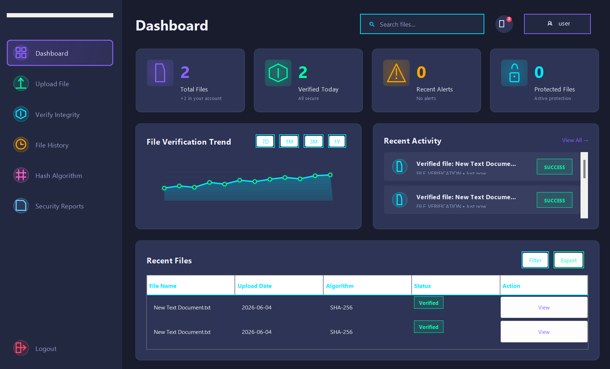
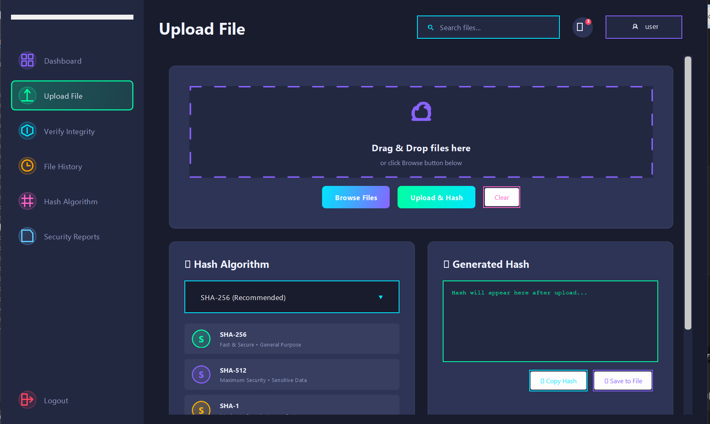
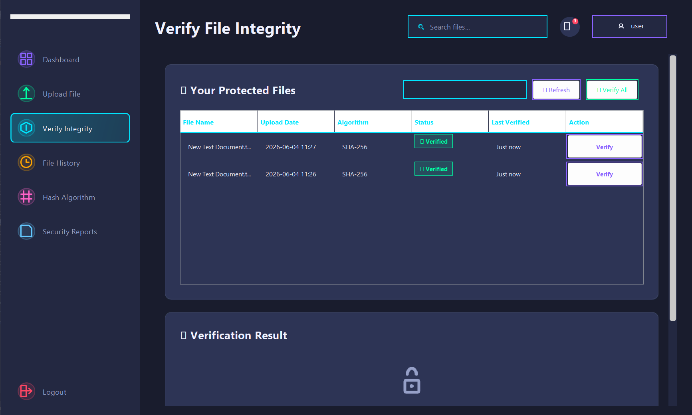
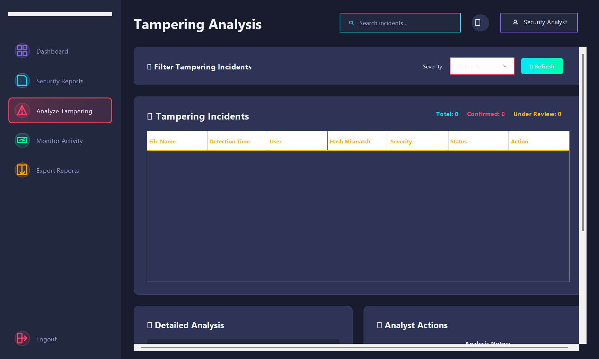

# ARION — File Integrity & Malware Management System

> A Java Swing desktop application for secure file management, hash-based integrity verification, attack simulation, and security reporting — built with a modern dark-themed UI.

---

## Screenshots

| User Dashboard | Upload File |
|---|---|
|  |  |

| Verify Integrity | Analyst — Tampering Analysis |
|---|---|
|  |  |

---

## Features

### 👤 Regular User
- Upload files and generate cryptographic hashes (MD5, SHA-1, SHA-256, SHA-512)
- Verify file integrity — detects tampering via hash comparison
- View full file activity history with filters
- Generate and export security reports (Daily, Weekly, Monthly, Tampering)

### 🔍 Security Analyst
- Real-time system activity monitoring with live log streaming
- Analyze tampering incidents with severity classification
- Review and annotate security reports
- Export reports in multiple formats

### 🛡️ Administrator
- Full user management (create, update, delete, lock/unlock)
- Configure system and security settings
- Set up and manage security policies
- Simulate malware/attack scenarios (File Tampering, Brute Force, SQL Injection, etc.)
- Maintain and archive audit logs

---

## Tech Stack

| Layer | Technology |
|---|---|
| Language | Java 17+ |
| UI Framework | Java Swing |
| Database | MySQL 8.x |
| DB Connectivity | JDBC (MySQL Connector/J) |
| Hashing | Java `MessageDigest` (built-in) |
| Build | Manual / IntelliJ IDEA / Eclipse |

---

## Project Structure

```
src/
└── com/
    └── arion/
        ├── base/          # BaseDashboard (shared UI logic)
        ├── dao/           # Data Access Objects (DB queries)
        ├── main/          # MainLauncher (entry point)
        ├── model/         # POJO / entity classes
        ├── service/       # Business logic layer
        └── ui/
            ├── admin/     # Admin dashboard & pages
            ├── analyst/   # Analyst dashboard & pages
            ├── common/    # Shared UI (Login, Signup, Icons)
            └── user/      # User dashboard & pages
```

---

## Prerequisites

- **Java JDK 17+** — [Download](https://adoptium.net/)
- **MySQL 8.x** — [Download](https://dev.mysql.com/downloads/)
- **MySQL Connector/J** JAR — [Download](https://dev.mysql.com/downloads/connector/j/)
- An IDE: **IntelliJ IDEA** or **Eclipse** (recommended)

---

## Setup & Installation

### 1. Clone the Repository

```bash
git clone https://github.com/YOUR_USERNAME/arion-file-integrity.git
cd arion-file-integrity
```

### 2. Create the MySQL Database

Open MySQL Workbench or your terminal and run:

```sql
CREATE DATABASE file_integrity_system;
USE file_integrity_system;
```

Then import the schema:

```bash
mysql -u root -p file_integrity_system < database/schema.sql
```

### 3. Configure Database Credentials

Edit `src/com/arion/util/DatabaseConnection.java`:

```java
private static final String URL      = "jdbc:mysql://localhost:3306/file_integrity_system";
private static final String USER     = "root";       // your MySQL username
private static final String PASSWORD = "your_password"; // your MySQL password
```

### 4. Add MySQL Connector JAR

- Download `mysql-connector-j-8.x.x.jar`
- In **IntelliJ**: `File → Project Structure → Libraries → + → Java → select JAR`
- In **Eclipse**: Right-click project → `Build Path → Add External Archives`

### 5. Run the Application

Run the main class:

```
com.arion.main.MainLauncher
```

A role-selection dialog will appear. Choose **Regular User**, **Security Analyst**, or **Administrator**.

---

## Default Login (after DB seeding)

| Role | Username | Password |
|---|---|---|
| Admin | `admin` | `admin123` |
| Analyst | `analyst` | `analyst123` |
| User | `user` | `user123` |

> ⚠️ Change all default passwords immediately after first login.

---

## Database Schema (Key Tables)

```
users                  — user accounts and roles
files                  — uploaded file metadata + hash values
file_upload_history    — per-file action logs
file_integrity_checks  — verification results (hash comparisons)
audit_logs             — system-wide action audit trail
attack_simulations     — malware simulation records
security_reports       — generated report metadata + content
```

---

## How It Works

1. **Upload** — File is copied to `uploads/`, a hash is computed and stored in the DB.
2. **Verify** — The file is re-hashed and compared to the stored hash. Mismatch = Tampered.
3. **Report** — The system aggregates activity and integrity data into downloadable reports.
4. **Simulate** — Admins can run controlled attack simulations to test detection response.

---

## Contributing

1. Fork the repository
2. Create a feature branch: `git checkout -b feature/my-feature`
3. Commit your changes: `git commit -m "Add my feature"`
4. Push to branch: `git push origin feature/my-feature`
5. Open a Pull Request

---

## License

This project is licensed under the **MIT License** — see [LICENSE](LICENSE) for details.

---

## Author

Built with ❤️ as part of a security systems project.
